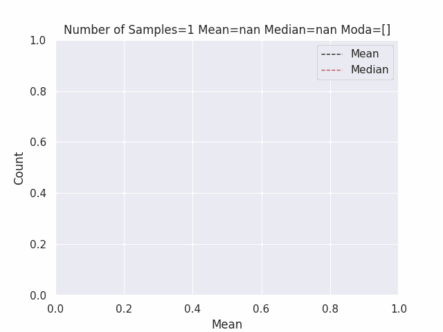

# Central_Limit

Simulating several toss of a coin

```bash
N = int(input("Number of toss of a coin: "))
size_sample = int(input("Size of the sample: "))
number_sample = int(input("Number of samples: "))
```

Number of toss of a coin: 10000

Size of the sample: 30

Number of samples: 200



